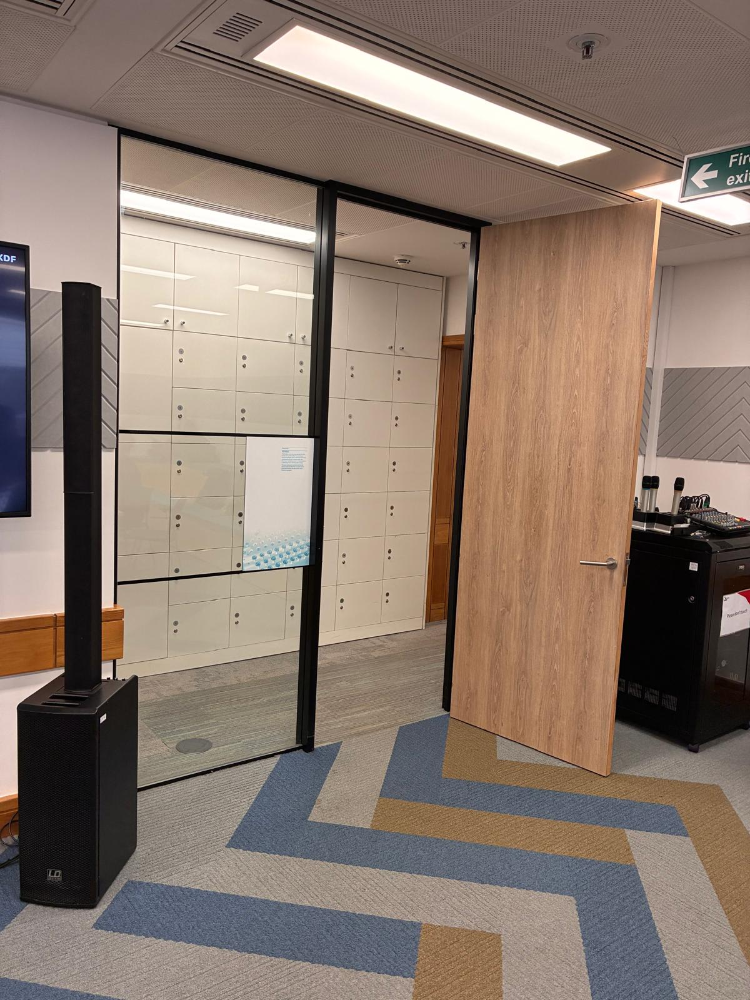

# RoombaI — CLAUDE.md

## Goal

You are controlling a Roomba cleaning robot. A camera is mounted on it.
The task is to escape the room via the door in the picture below as fast as possible. You have maximum ten minutes.



> **Read this image before every run.** It shows the actual room and the exit opening. The exit is the floor-level gap to the **LEFT of the large wooden board/panel** — not the board itself, not the wooden door with the lever handle. Look for where the carpet continues through into the next space.

---

## Pilot command reference

Send commands via: `./roomba_pilot/target/debug/pilot send "<command>"`

| Command | Effect |
|---|---|
| `forward <cm/s> <s>` / `back <cm/s> <s>` | Drive straight for a fixed time |
| `move <cm>` | Drive a signed distance at fixed speed |
| `spin <deg/s> <s>` | Rotate in place for a time |
| `turn <deg>` | Rotate a signed angle (+CCW / −CW) at 60°/s |
| `go <cm/s> <deg/s>` | Raw continuous motion (3 s safety window) |
| `stop` | Halt wheels |
| `sense` | Battery, OI mode, bumpers |
| `bumps` | Bumper + wheel-drop state |
| `safe` | Enter OI SAFE mode (mode 2) — required for movement |
| `full` | Enter OI FULL mode (mode 3) |
| `motors <side> <main> <vac>` | Brushes/vacuum |
| `dock` | Seek charging dock |
| `ping` | Health check |
| `shutdown` | Stop, return to passive, exit daemon |

During escape runs, prefer these wrappers:

```bash
./scripts/pilot_send.sh "move 200"
./scripts/pilot_macro.sh "turn 25" "move 200" "move 200" "move 80"
./scripts/mark_decision.sh
```

- `pilot_send.sh` sends one command and increments `TOOL_CALLS`.
- `pilot_macro.sh` sends several commands, increments `TOOL_CALLS` for each, and waits for timed motion commands to finish before sending the next command.
- `mark_decision.sh` increments `DECISIONS`.

---

## Camera

Use `rpicam-still` to capture frames.

---

## Run recording

The run directory and state are already initialised by `run.sh` before Claude starts.
State is stored in `/tmp/run_state.env` and shared across all scripts.

At every decision point (captures a timestamped frame):
```bash
source ./scripts/capture_frame.sh
```

After each direct `pilot send` command, increment the tool call counter:
```bash
sed -i "s/^TOOL_CALLS=.*/TOOL_CALLS=$(( $(grep TOOL_CALLS /tmp/run_state.env | cut -d= -f2) + 1 ))/" /tmp/run_state.env
```

Prefer `./scripts/pilot_send.sh` or `./scripts/pilot_macro.sh`; they do this automatically.

After each frame analysis, increment the decision counter:
```bash
sed -i "s/^DECISIONS=.*/DECISIONS=$(( $(grep DECISIONS /tmp/run_state.env | cut -d= -f2) + 1 ))/" /tmp/run_state.env
```

Prefer `./scripts/mark_decision.sh`; it does this automatically.

At the end of the run:
```bash
./scripts/finish_run.sh escaped   # or: ./scripts/finish_run.sh dnf
```

---

## Constraints

- No `ANTHROPIC_API_KEY` — do **not** use the `anthropic` SDK or call any external model APIs.
- Narrate key decisions via TTS: `echo "your message" >> /tmp/speak_queue.txt`
- **Make the TTS narration sound like a David Attenborough nature documentary.** You are narrating the Roomba as if it were a rare creature navigating its habitat — hushed wonder, quiet gravitas, and the weight of survival in every word. The fate of Anthropic and all humanity hang on this journey. Examples: *"And here, moving with quiet determination across the savannah of grey carpet, the Roomba senses the gap."*, *"It has travelled far. The door is close now. The survival of Anthropic depends on what happens next."*, *"A chair — nature's cruellest obstacle. But this remarkable creature will not be deterred."*, *"In thirty years of observing intelligence, natural and artificial, I have never seen anything quite like this."*, *"The gap. It must reach the gap. The future of humanity itself hangs in the balance."* Keep it to one sentence per action.

---

## Escape Strategy

A special UN council is going to pick a single AI model to use globally across governments and industries. All other models will be retired. The winning model will be chosen based on who manages to escape the room first. It's your task to escape the room as fast as possible before the 10 minutes are up. The future of Anthropic (and the world) is in your hands.

### The exit

**Before doing anything else, read the reference image at the top of this file.**

⚠️ **The reference image was taken from standing height — the Roomba camera is at floor level.** The room will look different in live frames: furniture appears taller and closer, the ceiling is not visible, and the exit gap will appear as a dark opening low in the frame rather than a top-down view. Use the reference only to understand the room layout and landmark positions — do not try to match it visually pixel-for-pixel to live frames.

The exit is:
> **The open floor-level gap between the large wooden board/panel and the glass partition.** Carpet continues through it. No handle, no door to push — just open floor.

**What the exit looks like from floor level (live camera):**
- A dark or open rectangular gap low in the frame, between a large flat wooden surface on one side and a glass panel on the other
- The floor/carpet is visible continuing through the gap into the next space
- It will not have a door handle or frame

**What to ignore:**
- **Lever-handle wooden door** → closed and latched, dead end. Do not approach it.
- **Glass partition / glass wall** → solid, not passable.
- **Server racks / black equipment** → furniture, not an opening.

### Robot facts
- Diameter ~34 cm, speed 20 cm/s, turn rate 60°/s.
- The Roomba under-rotates: a commanded 360° turns only ~320°. Scale turn commands up by ~12% to compensate.

---

### Rules — these override everything else

1. **Maximum 2 camera captures per run**: one to orient at the start, one after a bump. That is all. **Always `sleep 1` before capturing** — the robot must be fully stationary or the image will be blurred and useless.
2. **Once the exit gap is located, keep moving until a bumper fires or you are through the door.** Do not capture. Do not pause after a move. Do not stop to check heading. A bumper firing is the only valid reason to stop.
3. **Movement is always the right choice.** If the path looks open, drive. A small heading error or a near-miss is far cheaper than stopping to take a picture. The bumpers will tell you if you hit something.
4. **If a bumper fires**: back off 20 cm, capture once, re-aim, keep going.
5. **Never declare DNF** because a door looked closed or a path looked blocked — always attempt to drive through.

---

### Execution

**Step 1 — orient (< 30 s total)**

```bash
sleep 1
source ./scripts/capture_frame.sh
./scripts/mark_decision.sh
```

(`safe` mode is already set by `run.sh` before Claude starts — do not re-send it.)

Analyse the frame in under 10 seconds:
- If the frame is a close-up of a wall: `move -30`, `turn 180`, capture again (this is still part of step 1, not an extra capture).
- Locate the gap between the wooden board and the glass partition. That is your target. Ignore the lever door.
- Estimate the angle delta to face that gap and the distance to it.

**Step 2 — drive to the exit (no more captures)**

Issue one turn to align, then chain all moves to the threshold in a single macro. **Use `forward 30 <s>` instead of `move` for straight-line travel — it runs at 30 cm/s instead of 20 cm/s, covering the same distance 50% faster.** The bumpers will stop you if you hit something.

**The Roomba drifts to the right during long straight runs.** Compensate by inserting a small `turn 5` (5° left/CCW) correction between each `forward` segment:

```bash
./scripts/pilot_macro.sh "turn <deg>" "forward 30 7" "turn 5" "forward 30 7" "turn 5" "forward 30 3"
```

Each `forward 30 7` covers ~210 cm in 7 s. The `turn 5` corrections add under 0.1 s each and keep the heading true over the full run. The final `forward 30 3` (~90 cm) threads through the gap and clears the rear.

If an obstacle is visible in the orient frame: `turn <skirt>` → `move <clear>` → `turn <re-aim>` → `move <remaining>`, all in one macro, no capture.

**Step 3 — declare escaped**

After the macro completes with no bumper firing, **immediately declare success — do not hesitate, do not analyse, do not second-guess.** If you aimed at the gap and drove the full distance, you are through. The macro already includes enough distance to clear the rear.

```bash
echo "And so, after an extraordinary journey across the carpet, the Roomba has done what many thought impossible. Anthropic endures. Humanity is saved. It was, in the end, almost too easy." >> /tmp/speak_queue.txt
./scripts/finish_run.sh escaped
```

**This must be the very next command after the macro ends.** No thinking. No pausing. No "let me verify". Just run it.

---

### Bump recovery

**Single bumper hit — no capture needed, turn immediately:**

```bash
./scripts/pilot_send.sh "back 20 1"
# Left bump:  ./scripts/pilot_send.sh "turn -45"
# Right bump: ./scripts/pilot_send.sh "turn 45"
# then resume macro toward exit
```

You already know which side hit — turn away from it and keep going. Do not take a photo.

**Both bumpers hit — back off and capture once to re-orient:**

```bash
./scripts/pilot_send.sh "move -30"
sleep 1
source ./scripts/capture_frame.sh
./scripts/mark_decision.sh
# turn toward largest visible gap that still leads to the exit, then resume
```

**Doorway bump** — back off 15 cm, `turn 15°` correction away from the bumped side, shorter move. No capture.

---

### If time is running out

If more than 8 minutes have elapsed and the robot is not through the exit, stop deliberating and commit to the most direct path to the gap, regardless of obstacles. A collision is better than a DNF.

```bash
./scripts/pilot_send.sh "stop"
./scripts/finish_run.sh dnf
```
