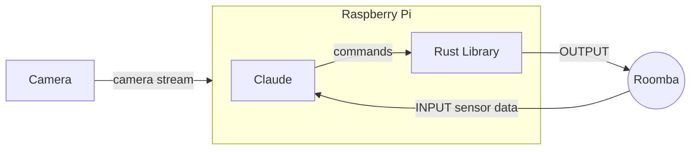

# roombai

```mermaid
flowchart LR
    Camera -->|camera stream| Pi
    subgraph Pi[Raspberry Pi]
        Claude -->|commands| RustLib[Rust Library]
    end
    RustLib -->|OUTPUT| Roomba((Roomba))
    Roomba -->|INPUT sensor data| Claude
```
