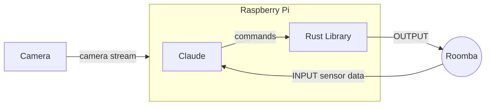

# roombai



# Launch the simulator (opens an 800×800 window)

```bash
cargo run -p simulator
```

- Optional speed multiplier (1‑100×) – speeds up the **simulation clock** and also scales movement speeds.
- The multiplier scales the internal time step *and* multiplies the base move speed (`MOVE_SPEED_CM_S`) by the factor, so commands such as `move`, `turn`, and `go` complete proportionally faster while preserving distances and angles.
- It also scales the speed of simulated humans; their base speed values are multiplied by the same factor.
- Provide a number after `--` to set the simulation speed, e.g.:
```bash
cargo run -p simulator -- 25   # runs at 25× speed (real‑time seconds are compressed)
```

```bash
cargo run -p simulator -- 25   # runs at 25× speed
```

In another terminal, send commands exactly as you would to the real pilot:

```
echo "move 50"    | nc localhost 9999   # drive forward 50 cm
echo "turn 90"    | nc localhost 9999   # rotate 90° CCW
echo "go 20 30"   | nc localhost 9999   # curve (20 cm/s + 30°/s), auto-stops after 3 s
echo "drive -100 100" | nc localhost 9999  # spin in place via wheel speeds
echo "stop"       | nc localhost 9999   # halt immediately
echo "ping"       | nc localhost 9999   # health check → "OK pong"
```

## Dimensions

- Roomba diameter: 34cm
- Door frame width (Enigma): 90cm